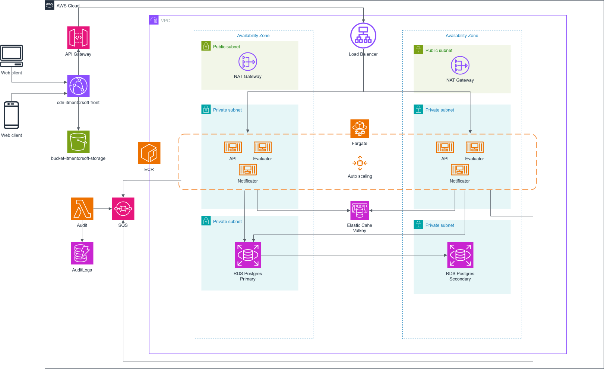

# ITMentorSoft - Infraestructura como Codigo (IaC)

Repositorio de infraestructura como codigo para **ITMentorSoft**, gestionado con Terraform sobre AWS. El proyecto esta organizado en dos sub-proyectos independientes — `infra-base` e `infra-app` — que permiten separar los recursos estables de aquellos que se destruyen y recrean con frecuencia durante el desarrollo.

## Tabla de contenidos

- [Requisitos previos](#requisitos-previos)
- [Estructura del proyecto](#estructura-del-proyecto)
- [Por que dos sub-proyectos](#por-que-dos-sub-proyectos)
- [Diagrama de arquitectura](#diagrama-de-arquitectura)
- [Arquitectura base](#arquitectura-base)
- [Modulos](#modulos)
- [Dependencias entre proyectos](#dependencias-entre-proyectos)
- [Comandos comunes de Terraform](#comandos-comunes-de-terraform)
- [Variables de entorno](#variables-de-entorno)
- [Consideraciones de seguridad](#consideraciones-de-seguridad)
- [Costos y optimizacion](#costos-y-optimizacion)

---

## Requisitos previos

| Herramienta       | Version requerida | Proposito                                    |
| ------------------ | ----------------- | -------------------------------------------- |
| Terraform          | `~> 6.0`          | Provisionamiento de infraestructura           |
| AWS CLI            | v2.x              | Configuracion de perfiles y credenciales      |
| Perfil AWS         | `itmentorsoft-terraform-dev` | Perfil configurado en `~/.aws/credentials` |
| Python             | 3.13              | Lambda `audit_consumer` (solo si se modifica) |

Configuracion del perfil AWS:

```bash
aws configure --profile itmentorsoft-terraform-dev
```

---

## Estructura del proyecto

```
itmentorsoft-iac/
├── infra-base/                       # Recursos estables (rara vez destruidos)
│   ├── environments/
│   │   └── dev.tfvars                # Variables para entorno de desarrollo
│   ├── lambda/
│   │   └── audit_consumer/           # Lambda Python 3.13 (SQS -> DynamoDB)
│   │       └── lambda_function.py
│   ├── modules/
│   │   ├── audit/                    # DynamoDB + Lambda + EventSource Mapping
│   │   ├── ecr/                      # Elastic Container Registry + OIDC
│   │   └── messaging/                # SQS Queues + DLQs
│   ├── main.tf                       # Orquestacion de modulos base
│   ├── outputs.tf                    # 7 outputs exportados a infra-app
│   ├── providers.tf                  # Backend: state/base/terraform.tfstate
│   ├── variables.tf
│   └── .terraform.lock.hcl
│
├── infra-app/                        # Recursos frecuentes (se destruyen/recrean)
│   ├── environments/
│   │   ├── base-outputs.json         # Referencia de outputs de infra-base
│   │   └── dev.tfvars                # Variables + valores cross-project
│   ├── modules/
│   │   ├── api_gateway/              # API Gateway V2 (placeholder)
│   │   ├── cache/                    # ElastiCache Valkey
│   │   ├── database/                 # RDS PostgreSQL
│   │   ├── ecs/                      # ECS Fargate + ALB + Autoscaling
│   │   ├── network/                  # VPC, Subnets, NAT, IGW, Rutas
│   │   └── security/                 # Security Groups
│   ├── main.tf                       # Orquestacion de modulos app
│   ├── providers.tf                  # Backend: state/app/terraform.tfstate
│   ├── variables.tf
│   └── .terraform.lock.hcl
│
├── docs/
│   └── ARCHITECTURE.md               # Documentacion detallada de arquitectura
└── .gitignore
```

> **Nota**: Los archivos `main.tf`, `providers.tf`, `variables.tf` y `.terraform.lock.hcl` que existian en la raiz del repositorio fueron eliminados tras la migracion. Pueden quedar residuos de `.terraform/` en la raiz; es seguro ignorarlos.

---

## Por que dos sub-proyectos

Durante el desarrollo es frecuente destruir y recrear la red, bases de datos y servicios ECS para iterar rapidamente. Sin embargo, recursos como los repositorios ECR, las colas SQS y la infraestructura de auditoria son estables y no deberian destruirse en cada ciclo.

El proyecto original (monolitico) ejecutaba `terraform destroy` sobre **todo** el estado, incluyendo recursos que tardan minutos en recrearse o que contienen datos persistentes (imagenes en ECR, mensajes en SQS). La separacion resuelve esto:

| Criterio                | `infra-base`                          | `infra-app`                              |
| ----------------------- | ------------------------------------- | ---------------------------------------- |
| Recursos                | ECR, SQS, Lambda audit, DynamoDB      | VPC, RDS, ElastiCache, ECS, ALB         |
| Frecuencia de destruccion| Rara vez (solo cambios de diseno)    | Frecuente (iteracion de desarrollo)      |
| Tiempo de recreacion    | Alto (colas, repos, tablas)           | Bajo-Medio (red, servicios, DB)          |
| Datos persistentes      | Imagenes Docker, mensajes, audit logs | Ninguno (todo es efimero en dev)         |

**Flujo operativo**: siempre desplegar `infra-base` primero, luego `infra-app`.

---

## Diagrama de arquitectura



---

## Arquitectura base

La infraestructura se despliega en una sola region AWS (`us-east-1`) dentro de una VPC segmentada en tres capas de red, siguiendo el principio de menor privilegio para el trafico entre componentes.

```
+------------------------------------------------------------------+
|                     AWS us-east-1                                  |
|                                                                    |
|  +--------------------------------------------------------------+ |
|  |              VPC (192.168.0.0/24)                             | |
|  |                                                              | |
|  |  +------------------------------------------------------+   | |
|  |  |  Subnets Publicas (2x /27)                           |   | |
|  |  |  [NAT Gateway]  <-->  [Internet Gateway]             |   | |
|  |  +------------------------------------------------------+   | |
|  |                                                              | |
|  |  +------------------------------------------------------+   | |
|  |  |  Subnets de Aplicacion (4x /27) - ECS Fargate        |   | |
|  |  |  [API Service]  [Evaluator]  [Notifier]              |   | |
|  |  |       |                                              |   | |
|  |  |  [ALB interno]                                       |   | |
|  |  +------------------------------------------------------+   | |
|  |                                                              | |
|  |  +------------------------------------------------------+   | |
|  |  |  Subnets de Base de Datos (2x /27)                   |   | |
|  |  |  [PostgreSQL (RDS)]    [Valkey (ElastiCache)]        |   | |
|  |  +------------------------------------------------------+   | |
|  +--------------------------------------------------------------+ |
|                                                                    |
|  [infra-base]                         [infra-app]                  |
|  ECR (3 repos)        SQS (4 colas)   Network, Security            |
|  Lambda audit         DynamoDB audit  Database, Cache              |
|                                       ECS, API Gateway             |
+------------------------------------------------------------------+
```

**Componentes principales:**

- **Red** (`infra-app`): VPC con subnets publicas, de aplicacion y de base de datos, separadas por tablas de rutas
- **Computo** (`infra-app`): 3 servicios ECS Fargate (API, Evaluator, Notifier) con autoscaling
- **Datos** (`infra-app`): PostgreSQL 18.3 en RDS + Valkey 7.2 en ElastiCache
- **Mensajeria** (`infra-base`): 4 colas SQS con dead-letter queues para procesamiento asincrono
- **Contenedores** (`infra-base`): 3 repositorios ECR con escaneo de imagenes y politica de ciclo de vida
- **Auditoria** (`infra-base`): Lambda (Python 3.13) que consume mensajes SQS de auditoria y los persiste en DynamoDB
- **Programador** (`infra-app`): EventBridge Scheduler para encender/apagar RDS en horario laboral

---

## Modulos

### infra-base (recursos estables)

| Modulo          | Descripcion                                              |
| --------------- | -------------------------------------------------------- |
| `ecr`           | 3 repositorios ECR + rol IAM para GitHub Actions (OIDC) |
| `messaging`     | 4 colas SQS con dead-letter queues y cifrado SSE        |
| `audit`         | DynamoDB + Lambda (Python 3.13) + EventSource Mapping desde SQS audit |

### infra-app (recursos frecuentes)

| Modulo          | Descripcion                                              |
| --------------- | -------------------------------------------------------- |
| `network`       | VPC, subnets, Internet Gateway, NAT Gateway, tablas de rutas |
| `security`      | 5 Security Groups (ALB, VPC Link, ECS, RDS, Cache)      |
| `database`      | RDS PostgreSQL con almacenamiento gp3 y programador de inicio/parada |
| `cache`         | ElastiCache Valkey con cifrado en reposo y en transito  |
| `ecs`           | Cluster Fargate, 3 servicios, ALB interno, autoscaling, CloudWatch |
| `api_gateway`   | Placeholder para API Gateway V2 (futuro)                |

---

## Dependencias entre proyectos

`infra-app` depende de 7 valores generados por `infra-base`. Estos valores se pasan manualmente via `dev.tfvars` en `infra-app`:

| Output (infra-base)          | Variable (infra-app)         | Tipo             |
| ---------------------------- | ---------------------------- | ---------------- |
| `ecr_image_api_url`          | `ecr_image_api_url`          | URL repositorio ECR |
| `ecr_image_evaluator_url`    | `ecr_image_evaluator_url`    | URL repositorio ECR |
| `ecr_image_notifier_url`     | `ecr_image_notifier_url`     | URL repositorio ECR |
| `evaluation_queue_url`       | `evaluation_queue_url`       | URL cola SQS     |
| `notification_queue_url`     | `notification_queue_url`     | URL cola SQS     |
| `audit_queue_url`            | `audit_queue_url`            | URL cola SQS     |
| `github_actions_role_arn`    | `github_actions_role_arn`    | ARN rol IAM OIDC |

### Flujo de sincronizacion manual

Actualmente las dependencias cross-project se resuelven de forma manual:

```bash
# 1. Desplegar infra-base y obtener outputs
cd infra-base
terraform apply -var-file="environments/dev.tfvars"
terraform output -json > ../infra-app/environments/base-outputs.json

# 2. Copiar los valores relevantes a infra-app/environments/dev.tfvars
#    (las 7 variables listadas arriba)

# 3. Desplegar infra-app
cd ../infra-app
terraform apply -var-file="environments/dev.tfvars"
```

> **Nota**: Este mecanismo manual funciona para el ritmo actual de desarrollo. Si la sincronizacion frecuente se vuelve tediosa, se puede automatizar con un script o migrar a un mecanismo de remote state data source en el futuro.

---

## Comandos comunes de Terraform

Todos los comandos se ejecutan **desde el sub-proyecto correspondiente** (`infra-base/` o `infra-app/`).

### Inicializacion

```bash
# Desde infra-base/
cd infra-base
terraform init

# Desde infra-app/
cd infra-app
terraform init
```

Inicializa el backend S3 remoto y descarga los providers necesarios. Cada proyecto tiene su propia key de estado:

| Proyecto     | Bucket                              | Key                            |
| ------------ | ----------------------------------- | ------------------------------ |
| `infra-base` | `dev-bucket-itmentorsoft-iac-001`  | `state/base/terraform.tfstate` |
| `infra-app`  | `dev-bucket-itmentorsoft-iac-001`  | `state/app/terraform.tfstate`  |

Ambos estados usan cifrado SSE-S3.

### Planificar cambios

```bash
# Planificar infra-base
terraform plan -var-file="environments/dev.tfvars"

# Planificar infra-app
terraform plan -var-file="environments/dev.tfvars"
```

Muestra un resumen de los cambios que se aplicaran sin modificar la infraestructura. Siempre revisar el plan antes de aplicar.

### Aplicar cambios

```bash
terraform apply -var-file="environments/dev.tfvars"
```

Aplica los cambios planificados a la infraestructura. Requiere confirmacion interactiva (usar `-auto-approve` para omitir en CI/CD).

### Destruir infraestructura

```bash
# Solo destruir infra-app (seguro — no afecta recursos estables)
cd infra-app
terraform destroy -var-file="environments/dev.tfvars"

# Destruir infra-base (PRECAUCION: elimina ECR, SQS, DynamoDB audit)
cd infra-base
terraform destroy -var-file="environments/dev.tfvars"
```

> **Importante**: el proposito principal de la separacion es poder destruir `infra-app` sin afectar `infra-base`. Destruir `infra-base` requiere precaucion adicional porque elimina repositorios de imagenes, colas de mensajes y la tabla de auditoria.

### Formatear codigo

```bash
# Desde la raiz del repositorio (formatea ambos sub-proyectos)
terraform fmt -recursive

# O desde un sub-proyecto especifico
cd infra-base && terraform fmt -recursive
cd infra-app && terraform fmt -recursive
```

Formatea los archivos `.tf` siguiendo el estilo canonico de Terraform. `-recursive` aplica a subdirectorios (modulos).

### Validar configuracion

```bash
# Desde cada sub-proyecto
terraform validate
```

Verifica que la sintaxis y configuracion sean correctas sin consultar el provider.

### Workspaces (entornos)

```bash
# Cada sub-proyecto tiene sus propios workspaces
terraform workspace list          # Listar workspaces existentes
terraform workspace new staging   # Crear nuevo workspace
terraform workspace select dev    # Cambiar a workspace dev
terraform workspace show          # Mostrar workspace activo
```

Los workspaces permiten separar el estado de Terraform por entorno (dev, staging, prod) usando la misma configuracion base. Ambos sub-proyectos deben estar en el mismo workspace para que las dependencias cross-project sean coherentes.

### Consultar outputs

```bash
# Ver outputs de infra-base (util para copiar valores a infra-app)
cd infra-base
terraform output                  # Todos los outputs
terraform output -json            # Formato JSON (ideal para redirigir a archivo)

# Ver outputs de infra-app
cd infra-app
terraform output
```

### Inspeccionar estado

```bash
terraform state list              # Listar recursos en el estado
terraform state show <resource>   # Detalle de un recurso
terraform state mv <src> <dst>   # Mover recurso en el estado
```

### Importar recursos existentes

```bash
terraform import <resource_type>.<name> <resource_id>
```

Permite incorporar recursos creados manualmente al estado de Terraform.

---

## Variables de entorno

Cada sub-proyecto tiene su propio directorio `environments/` con archivos `.tfvars`:

```
infra-base/environments/
└── dev.tfvars    # Variables de infra-base (ECR, SQS, audit)

infra-app/environments/
├── base-outputs.json   # Referencia de outputs de infra-base
└── dev.tfvars          # Variables de infra-app + valores cross-project
```

### Variables infra-base

| Variable                  | Tipo            | Descripcion                                  |
| ------------------------- | --------------- | -------------------------------------------- |
| `project`                 | `string`        | Nombre del proyecto                          |
| `owner`                   | `string`        | Propietario de los recursos                  |
| `queues`                  | `list(string)`  | Nombres de colas SQS a crear                 |
| `ecr_repository_names`    | `list(string)`  | Nombres de repositorios ECR                  |
| `github_repositories`     | `list(string)`  | Repositorios autorizados para OIDC           |

### Variables infra-app

| Variable                  | Tipo          | Descripcion                                  |
| ------------------------- | ------------- | -------------------------------------------- |
| `project`                 | `string`      | Nombre del proyecto                          |
| `owner`                   | `string`      | Propietario de los recursos                  |
| `aws_region`              | `string`      | Region AWS de despliegue                     |
| `vpc_cidr`                | `string`      | Bloque CIDR de la VPC                        |
| `availability_zones`      | `list(string)`| Zonas de disponibilidad                      |
| `public_subnets`          | `list(string)`| CIDRs de subnets publicas                    |
| `app_subnets`             | `list(string)`| CIDRs de subnets de aplicacion               |
| `db_subnets`              | `list(string)`| CIDRs de subnets de base de datos            |
| `api_port`                | `number`      | Puerto del contenedor API                    |
| `db_instance_class`       | `string`      | Clase de instancia RDS                       |
| `db_engine_version`       | `string`      | Version del motor PostgreSQL                 |
| `db_name`                 | `string`      | Nombre de la base de datos                   |
| `multi_az`                | `bool`        | RDS Multi-AZ                                 |
| `cache_node_type`         | `string`      | Tipo de nodo ElastiCache                     |
| `api_cpu` / `api_memory`  | `number`      | Recursos CPU/Memoria para el API             |
| `worker_cpu` / `worker_memory` | `number` | Recursos CPU/Memoria para workers            |
| `api_min_capacity`        | `number`      | Minimo de instancias API                     |
| `api_max_capacity`        | `number`      | Maximo de instancias API                     |
| `worker_desired_count`    | `number`      | Tareas deseadas para workers                 |

### Variables cross-project (infra-app)

Estas variables reciben sus valores de los outputs de `infra-base` y se definen en `infra-app/environments/dev.tfvars`:

| Variable                       | Origen                |
| ------------------------------ | --------------------- |
| `ecr_image_api_url`            | `infra-base` ECR      |
| `ecr_image_evaluator_url`      | `infra-base` ECR      |
| `ecr_image_notifier_url`       | `infra-base` ECR      |
| `evaluation_queue_url`         | `infra-base` SQS      |
| `notification_queue_url`       | `infra-base` SQS      |
| `audit_queue_url`              | `infra-base` SQS      |
| `github_actions_role_arn`      | `infra-base` IAM/OIDC |

Para agregar un nuevo entorno, crear un archivo `<env>.tfvars` en cada sub-proyecto y usar el workspace de Terraform:

```bash
# En ambos sub-proyectos
terraform workspace new <env>
terraform plan -var-file="environments/<env>.tfvars"
```

---

## Consideraciones de seguridad

- **Cifrado en reposo**: RDS (gp3 cifrado), ElastiCache (cifrado at-rest), SQS (SSE administrado por SQS), ECR (AES256), DynamoDB (cifrado predeterminado), estado S3 (SSE-S3)
- **Cifrado en transito**: ElastiCache (TLS habilitado), comunicacion entre servicios via Security Groups
- **Security Groups**: Aislamiento por capas, solo el trafico necesario entre componentes (ver [ARCHITECTURE.md](docs/ARCHITECTURE.md#seguridad))
- **IAM**: Roles minimos para ECS (execution + task), integracion OIDC con GitHub Actions sin credenciales estaticas, rol Lambda con permisos scoped a la tabla DynamoDB y cola SQS de auditoria
- **Secretos**: Las credenciales de base de datos se pasan como variables de entorno a los contenedores. Considerar migrar a AWS Secrets Manager o SSM Parameter Store para produccion
- **Escaneo de imagenes**: ECR escanea imagenes automaticamente al hacer push
- **Politica de ciclo de vida**: ECR mantiene solo las 10 imagenes mas recientes
- **TTL en auditoria**: Los registros en DynamoDB tienen TTL de 30 dias, se eliminan automaticamente

---

## Costos y optimizacion

| Estrategia                          | Detalle                                                  |
| ----------------------------------- | -------------------------------------------------------- |
| Programador RDS                     | Encendido solo Lun-Vie 4:00 PM - 8:00 PM (hora Colombia) |
| Instancias pequenas                 | `db.t4g.micro` (RDS), `cache.t4g.micro` (Valkey)        |
| Fargate bajo demanda                | Pago por uso real de CPU/Memoria                         |
| Autoscaling API                     | 2-4 tareas segun carga (target CPU 60%)                  |
| Subnets de base de datos sin NAT    | Sin costo de salida a internet para DB                   |
| ECR lifecycle policy                | Solo 10 imagenes, reduce almacenamiento                  |
| DynamoDB TTL                        | Limpieza automatica de registros de auditoria (30 dias)  |
| Lambda audit                        | Ejecucion on-demand, solo paga por invocaciones          |

**Estimacion de recursos dev:**

| Componente       | Spec                          | Proyecto       |
| ---------------- | ----------------------------- | -------------- |
| API              | 512 CPU / 1024 MiB x 2-4     | infra-app      |
| Evaluator        | 512 CPU / 1024 MiB x 2       | infra-app      |
| Notifier         | 512 CPU / 1024 MiB x 2       | infra-app      |
| RDS              | db.t4g.micro, 20 GB gp3       | infra-app      |
| ElastiCache      | cache.t4g.micro, Valkey 7.2   | infra-app      |
| ECR              | 3 repositorios                | infra-base     |
| SQS              | 4 colas + 4 DLQs             | infra-base     |
| Lambda audit     | Python 3.13, on-demand        | infra-base     |
| DynamoDB audit   | On-demand billing             | infra-base     |

Para mas detalles sobre la arquitectura, consultar [docs/ARCHITECTURE.md](docs/ARCHITECTURE.md).
